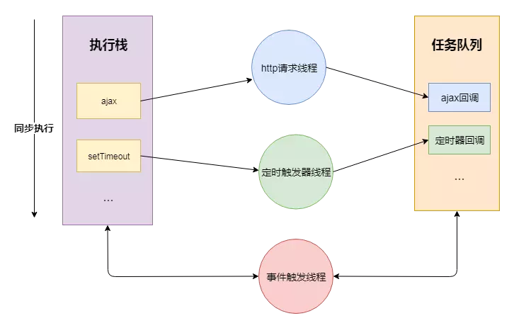

### 浏览器进程  
浏览器包含了 主进程、第三方插件进程、GPU进程、渲染进程（浏览器内核）  
#### 1、主进程  
* 协调控制其他子进程（创建、销毁）  
* 浏览器界面显示，用户交互，前进、后退、收藏
* 将渲染进程得到的内存中的Bitmap，绘制到用户界面上
* 处理不可见操作，网络请求，文件访问等  
#### 2、第三方插件进程  
* 每种类型的插件对应一个进程，仅当使用该插件时创建 
#### 3、GPU进程  
* 用于3D绘制等  
#### 4、渲染进程（浏览器内核）（前端相关!）  
* 负责页面渲染，脚本执行，事件处理等  
* 每个tab页面一个渲染进程  
  
  
### 渲染进程的子线程  
渲染进程包含 GUI渲染线程、JS引擎线程、事件触发线程、定时触发器线程、异步http请求线程。  
* GUI渲染线程  
  1. 负责渲染页面，布局和绘制  
  2. 页面需要重绘和回流时，该线程就会执行  
  3. 与js引擎线程互斥，防止渲染结果不可预期  
* JS引擎线程 
  1. 负责处理解析和执行JavaScrip脚本程序  
  2. 只有一个JS引擎线程（单线程） 
  3. 与GUI渲染线程互斥，防止渲染结果不可预期  
* 事件触发线程  
  1. 用来控制事件循环（鼠标点击、setTimeout、Ajax等）  
  2. 当事件满足触发条件时，将事件放入到JS引擎所在的执行队列中  
* 定时触发器线程  
  1. setInterval与setTimeout所在的线程  
  2. 定时任务并不是由JS引擎计时的，是由定时触发线程来计时的  
  3. 计时完毕后，通知事件触发线程 
* 异步http请求线程  
  1. 浏览器有一个单独的线程用于处理AJAX请求  
  2. 当请求完成时，若有回调函数，通知事件触发线程  
## 从Evet Loop 看JS的运行机制  
  * JS分为同步任务和异步任务  
  * 同步任务都在JS引擎线程上执行，形成一个执行栈  
  * 事件触发线程管理一个任务队列，异步任务触发条件达成，将回调事件放到任务队列中  
  * 执行栈中所有同步任务执行完毕，此时JS引擎线程空闲，系统会读取任务列表，将可运行的异步任务回调事件添加到执行栈中，开始执行  

  

  在前端开发中我们会通过setTimeout/setInterval来指定定时任务，会通过XHR/fetch发送网络请求，
接下来简述一下setTimeout/setInterval和XHR/fetch到底做了什么事   
我们知道，不管是setTimeout/setInterval和XHR/fetch代码，在这些代码执行时，
本身是同步任务，而其中的回调函数才是异步任务。  
    当代码执行到setTimeout/setInterval时，实际上是JS引擎线程通知定时触发器线程，间隔一个时间后，会触发一个回调事件，
而定时触发器线程在接收到这个消息后，会在等待的时间后，将回调事件放入到由事件触发线程所管理的事件队列中。  
当代码执行到XHR/fetch时，实际上是JS引擎线程通知异步http请求线程，发送一个网络请求，并制定请求完成后的回调事件，
而异步http请求线程在接收到这个消息后，会在请求成功后，将回调事件放入到由事件触发线程所管理的事件队列中。  
    当我们的同步任务执行完，JS引擎线程会询问事件触发线程，在事件队列中是否有待执行的回调函数，如果有就会加入到执行栈中交给JS引擎线程执行  
  
#### 总结  
* JS引擎线程只执行执行栈中的事件 
* 执行栈中的代码执行完毕，就会读取事件队列中的事件 
* 事件队列中的回调事件，是由各自线程插入到事件队列中的  
* 如此循环